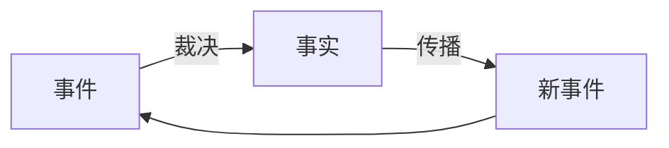

# 因果传播网络 {#causal-layer-mechanism}

> **事件需要裁决，事实需要传播。**

因果层的本质是时间的隐喻，事件是因果层的最小单位。



在这个闭环中，事件是输入，事实是输出，传播让输出成为下一轮输入。因果层通过不断运转这个循环，把外部世界的无序变化，整理成系统内部可追溯、可解释的历史。

---

## 事件与事实

**事件**是尚未被世界接受的变化请求。它可以来自外部输入，也可以来自因果层内部的传播。

**事实**是事件经过裁决之后，被正式承认进入历史的关系变化。

两者的区别至关重要：

- 事件可以冲突、可以无效、可以被丢弃
- 事实一旦成立，就不会被原地改写，后续变化只能以新事实追加

这意味着因果层维护的不是「当前状态」，而是一条**持续增长的历史链**。状态只是这条链在当前时刻的投影。

```text
状态模型:         因果模型:
hp = 100         damage_taken
hp = 80          hp_depleted
hp = 0           entity_dead
```

> 参见[因果层](/docs/dual-world-theory/theory#causal-layer)

---

## 裁决与传播

因果层通过两类规则运行：

- **裁决规则**：决定事件能否成为事实。从应用层视角看，它就是一条计算规则：

  ```text
  (event, history) => Fact | null
  ```

  它包含两个环节：
  - **资格审查**：检查事件是否满足生效条件；
  - **事实生成**：根据输入生成事实内容。
- **传播规则**：决定事实会产生哪些新事件，推动下一轮循环。

裁决规则本质上是无状态的纯函数。给定一个事件和当前事实历史，它输出新事实或拒绝。事件何时到达、是否并发、是否冲突，都不是它需要关心的事。

锁、CAS 等并发原语，诞生于冯诺依曼的共享内存模型：多个执行流同时读写同一块内存，必须用它们来保护这块内存不被破坏。

在面向因果的视角中，竞争与顺序由系统排序机制处理，不应该将共享内存和锁的并发原语暴露给应用层。

<details>
<summary>工程实现细节</summary>

排序机制的实现层次：

- **冯诺依曼架构层面**：重新设计硬件原生支持事件排序，理想情况无锁。
- **语言 / 运行时层面**：单线程事件循环天然无锁；多线程运行时内部可能仍需锁。
- **分布式层面**：通过消息队列和共识协议达成全局顺序。

应用层应该保持始终无锁；底层是否无锁取决于实现。这种事件驱动结构与 Actor 模型相似，工程上可以用来参考。

</details>

以游戏里的一次攻击为例：

```text
玩家按下攻击键
        ↓
attack_requested（事件）
        ↓
裁决规则（计算规则）：
  ├── 资格审查：目标在范围内？技能冷却？敌人闪避判定？
  └── 事实生成：攻击力 × Buff加成 − 敌人防御力 = 伤害值
        ↓
damage_applied（事实）
        ↓
传播：death_check_requested（事件）
        ↓裁决规则（计算规则）：
  ├── 资格审查：hp 是否小于 0？是否免疫致命伤害？是否可以复活？
  └── 事实生成：确定死亡事实与相关派生值
        ↓
entity_dead（事实）
        ↓
传播：触发亡语、QTE、生成掉落物、更新任务、获取经验、触发升级、触发新剧情（新事件）
```

裁决与传播的关系：

> **裁决把不确定性收敛成事实；传播让事实重新打开不确定性。**

---

## 工程约定

| 层次 | 职责 | 实现者 |
|---|---|---|
| **业务规则层** | 计算规则、传播规则、感知层 | 业务开发者 |
| **因果运行时层** | 原子排序机制、规则调度 | 框架 / 中间件 |

---

## 因果传播网络

没有时间，世界只是静态关系图；引入时间，静态结构就变成**因果传播网络**。

因果传播网络是因果层的核心数据模型，可以看作一个不断产生变化的因果图。它要处理六类基本拓扑：

:::note

**排序机制保证事件进入网络的顺序，但它本身不是网络拓扑。** 竞争与时序由排序机制处理，不应被当作变化如何连接与流动的问题。

:::

### 六类基本拓扑

**1. 分叉（Branching）**

一个事实影响多个未来事件：

```text
    Fact
   /  |  \
  v   v   v
 A     B     C
```

**2. 合并（Merging）**

多个事实共同产生新的变化：

```text
Fact A      Fact B
   \          /
    v        v
      Event C
```

**3. 循环（Feedback）**

传播重新影响自身：

```text
A → B → C
↑       |
└───────┘
```

**4. 抢占（Preemption）**

新的事件打断已有传播：

```text
A → B → C
    ↑
    X  （新事件中断 B→C）
```

**5. 延迟（Delay）**

事实的影响发生在未来：

```text
订单创建
   |
30分钟
   ↓
订单超时
```

**6. 计算（Computation）**

多个输入通过确定性规则共同产生一个事实。计算规则本身无时间、无并发、无冲突，只关注结果正确性：

```text
Event A     Event B     Fact D
   \           /          /
    v         v          /
      [计算规则]  ←──────
         |
         v
       Fact C
```

### 拓扑的工程映射

| 因果复杂性 | 软件工程中的表现 | 典型技术方案 |
|---|---|---|
| 分叉 | 一个变化影响多个模块 | 事件总线、发布订阅、Observer、消息队列 |
| 合并 | 多个条件共同决定行为 | 状态机、规则引擎、CEP、Workflow |
| 循环 | 变化不断相互影响 | 反馈控制系统核心、事务边界、最大迭代次数、资源限制 |
| 延迟 | 未来某个时间发生变化 | Timer、Scheduler、Job Queue、Cron、Timeout |
| 抢占 | 新事件打断旧过程 | 中断、取消令牌、事务回滚、状态机切换 |
| 计算 | 多输入经确定性规则产生事实 | 纯函数、公式系统、类型安全的规则引擎、确定性状态机 |


**对象、状态、模块只是传播路径的空间容器。软件工程里那些看似不相关的领域——并发、分布式、事务、中断、超时、反馈控制——本质上都是同一个因果传播网络在不同约束下的表现。**

---

## 核心性质

因果层要可靠运转，必须具备四个性质：

**可裁决性**：冲突不能永远悬而不决，系统必须给出明确事实版本。

**确定性**：相同的历史事实、事件和规则，必须得到相同结果。

**可追溯性**：每个事实都能追溯完整因果链。

**收敛性**：任何有限范围内的因果传播必须在有限时间内结束。

其中收敛性最为重要，前三个只是为了保障收敛而设立的，它是世界能稳定运转的根本保证，参见[最终因果一致性](/docs/dual-world-theory/theory#eventual-causal-consistency)。

---

## 总结

> **因果层是世界事实的唯一生成通道。它通过「事件 → 裁决 → 事实 → 传播」的循环，把持续变化整理成稳定、可解释、可追溯的历史。**
