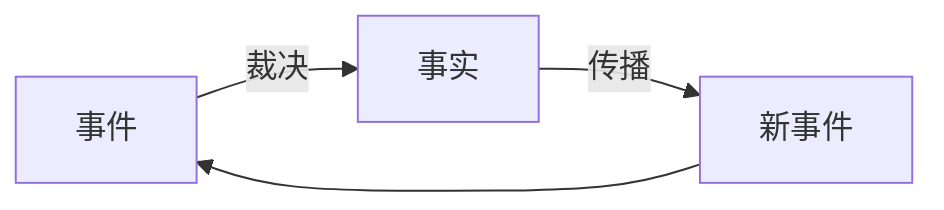

# 因果传播网络 {#causal-layer-mechanism}

> **事件需要裁决，事实需要传播。**

因果层的本质是时间的隐喻，事件是因果层的最小单位。



在这个闭环中，事件是输入，事实是输出，传播让输出成为下一轮输入。因果层通过不断运转这个循环，把外部世界的无序变化，整理成系统内部可追溯、可解释的历史。

---

## 事件与事实

**事件**是尚未被世界接受的变化请求。它可以来自外部输入，也可以来自因果层内部的传播。

**事实**是事件经过裁决之后，被正式承认进入历史的关系变化。

两者的区别至关重要：

- 事件可以冲突、可以无效、可以被丢弃
- 事实一旦成立，就不会被原地改写，后续变化只能以新事实追加

这意味着因果层维护的不是「当前状态」，而是一条**持续增长的历史链**。状态只是这条链在当前时刻的投影。

```text
状态模型:         因果模型:
hp = 100         damage_taken
hp = 80          hp_depleted
hp = 0           entity_dead
```

> 参见[因果层](/docs/dual-world-theory/theory#causal-layer)

---

## 裁决与传播

因果层通过两类规则运行：

- **裁决规则**：决定事件能否成为事实。
- **传播规则**：决定事实会产生哪些新事件。

以游戏里的一次攻击为例：

```text
玩家按下攻击键
        ↓
attack_requested（事件）
        ↓
裁决规则：目标在范围内？技能冷却？敌人闪避成功？玩家攻击Buff加成？敌人防御力减伤？触发敌人反击？触发战吼？
        ↓
damage_applied（事实）
        ↓
传播：death_check_requested（事件）
        ↓
裁决规则：hp 是否小于 0? 是否免疫致命伤害？是否可以复活？
        ↓
entity_dead（事实）
        ↓
传播：触发亡语、QTE、生成掉落物、更新任务、获取经验、触发升级、触发新剧情（新事件）
```

裁决和传播是同一枚硬币的两面：

> **裁决把不确定性收敛成事实；传播让事实重新打开不确定性。**

---

## 因果传播网络

如果没有时间，世界就是一张静态关系图：对象、状态、关系。这种复杂度来自规模，是**空间复杂度**。

一旦引入时间，复杂度就不再来自「有什么」，而来自**「变化如何传播」**。传统面向对象问的是空间问题：谁拥有这个数据？谁属于谁？但复杂软件真正让我们头疼的是时间问题：**一个变化如何引起其他变化？无限的变化又如何让世界保持稳定？**

于是，静态结构就变成了**因果传播网络**。

因果传播网络是因果层的核心数据模型，可以看作一个不断产生变化的因果图。它要处理六类基本拓扑：

### 六类基本拓扑

**1. 分叉（Branching）**

一个事实影响多个未来事件：

```text
    Fact
   /  |  \
  v   v   v
 A     B     C
```

**2. 合并（Merging）**

多个事实共同产生新的变化：

```text
Fact A      Fact B
   \          /
    v        v
      Event C
```

**3. 循环（Feedback）**

传播重新影响自身：

```text
A → B → C
↑       |
└───────┘
```

**4. 抢占（Preemption）**

新的事件打断已有传播：

```text
A → B → C
    ↑
    X  （新事件中断 B→C）
```

**5. 延迟（Delay）**

事实的影响发生在未来：

```text
订单创建
   |
30分钟
   ↓
订单超时
```

**6. 竞争与顺序（Competition & Ordering）**

多个事件塑造一个事实：

```text
Event A     Event B
   \           /
    v         v
      Fact C
```

### 拓扑的工程映射

| 因果复杂性 | 软件工程中的表现 | 典型技术方案 |
|---|---|---|
| 分叉 | 一个变化影响多个模块 | 事件总线、发布订阅、Observer、消息队列 |
| 合并 | 多个条件共同决定行为 | 状态机、规则引擎、CEP、Workflow |
| 循环 | 变化不断相互影响 | 反馈控制系统核心、事务边界、最大迭代次数、资源限制 |
| 延迟 | 未来某个时间发生变化 | Timer、Scheduler、Job Queue、Cron、Timeout |
| 抢占 | 新事件打断旧过程 | 中断、取消令牌、事务回滚、状态机切换 |
| 竞争与顺序 | 多个变化争夺同一结果 | 锁、CAS、事务、共识、调度器 |


**对象、状态、模块只是传播路径的空间容器。软件工程里那些看似不相关的领域——并发、分布式、事务、中断、超时、反馈控制——本质上都是同一个因果传播网络在不同约束下的表现。**

:::tip[核心洞察]

**宏观世界从未有过真正意义上的并行；所谓的并行，只是串行历史在空间中的投影。**

:::

---

## 核心性质

因果层要可靠运转，必须具备四个性质：

**可裁决性**：冲突不能永远悬而不决，系统必须给出明确事实版本。

**确定性**：相同的历史事实、事件和规则，必须得到相同结果。

**可追溯性**：每个事实都能追溯完整因果链。

**收敛性**：任何有限范围内的因果传播必须在有限时间内结束。

其中收敛性最为重要，前三个只是为了保障收敛而设立的，它是世界能稳定运转的根本保证，参见[最终因果一致性](/docs/dual-world-theory/theory#eventual-causal-consistency)。

---

## 不同系统中的因果层

| 系统 | 事件 | 裁决规则 | 事实 |
|---|---|---|---|
| 游戏服务器 | 玩家操作 | 命中判定、伤害计算 | 权威事实版本 |
| 数据库 | 事务请求 | 隔离级别、约束检查 | 提交后的数据版本 |
| 操作系统 | 中断、系统调用 | 调度策略、权限检查 | 资源分配结果 |
| 区块链 | 交易广播 | 共识机制、签名验证 | 上链交易 |
| 交易所 | 订单提交 | 撮合规则、价格优先 | 成交记录 |

结构相同，约束不同。

---

## 总结

> **因果层是世界事实的唯一生成通道。它通过「事件 → 裁决 → 事实 → 传播」的循环，把持续变化整理成稳定、可解释、可追溯的历史。**
